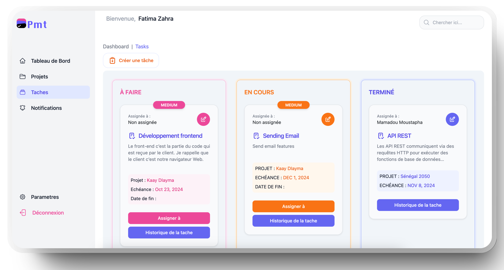

# Project Management Tool (PMT) - Backend Documentation

## Table des Matières

1. [Introduction](#introduction)
2. [Installation et Configuration](#installation-et-configuration)
3. [Architecture du Projet](#architecture-du-projet)
4. [Fonctionnalités Principales](#fonctionnalités-principales)
5. [Description des Entités](#description-des-entités)
6. [Tests Unitaires](#tests-unitaires)
7. [Endpoints de l'API](#endpoints-de-lapi)
8. [Dockerisation](#dockerisation)
9. [Contributeurs](#contributeurs)




### 1. Introduction
L'application **PMT** est un outil de gestion de projets conçu pour faciliter la création, la gestion et la supervision de projets avec divers rôles (administrateur, membre, observateur) et différentes entités (projets, tâches, utilisateurs, etc.). Elle inclut des fonctionnalités avancées pour l’attribution de rôles, la gestion des tâches et le suivi des mouvements.

### 2. Installation et Configuration

#### Prérequis
- **Java 17**
- **Docker et Docker Compose**
- **Maven**

#### Étapes d'Installation
1. Cloner le dépôt :
   ```bash
   git clone https://github.com/alaminediassy/pmt-backend.git
   cd pmt-backend
   ```

2. Configurer les fichiers de l’application, y compris les informations de connexion à la base de données et la configuration des JWT dans `application.properties`.

3. **Lancer l’application** :
   ```bash
   docker-compose up --build -d
   ```

### 3. Architecture du Projet

Le backend est structuré selon une architecture en couches, facilitant la séparation des préoccupations et la maintenabilité :

- **config** : Contient les classes de configuration de l'application, y compris la configuration de la sécurité, JWT, et autres paramètres.
- **controller** : Gère les requêtes HTTP entrantes et les réponses associées. Chaque contrôleur est dédié à une ressource principale (utilisateurs, projets, tâches, etc.).
- **dto** : Définit les classes Data Transfer Objects (DTO) pour structurer et transporter les données entre les couches de l'application, sans exposer directement les entités.
- **entity** : Représente les modèles d'entités persistés dans la base de données. Chaque entité correspond à une table de la base de données (ex. `AppUser`, `Project`, `Task`).
- **enums** : Contient les énumérations utilisées dans le projet pour des valeurs de type fixe, comme les rôles d'utilisateur ou les statuts de tâche.
- **exception** : Gère les exceptions personnalisées pour traiter les erreurs spécifiques de l'application.
- **jwt** : Contient les classes liées à la gestion des tokens JWT, y compris la génération, validation et vérification des tokens.
- **repository** : Contient les interfaces pour l'accès aux données, en utilisant Spring Data JPA pour communiquer avec la base de données.
- **service** : Contient la logique métier principale de l'application. Les services orchestrent les opérations sur les entités en combinant la logique des `repository` et les règles métiers.

Dans **src/main/resources**, on trouve :
- `application.properties` : Fichier de configuration principal pour les propriétés de l’application, comme les paramètres de base de données et de sécurité.
- `application.properties.example` : Exemple du fichier de configuration sans les informations sensibles, pour faciliter la configuration par d'autres développeurs.

La racine du projet contient également des fichiers clés pour la gestion des dépendances et le déploiement :
- **Dockerfile** : Définit l’image de l’application pour la containerisation.
- **docker-compose.yml** : Automatisation de l'orchestration des conteneurs pour l'application et la base de données.
- **pom.xml** : Fichier de gestion des dépendances Maven.
- **README.md** : Documentation du projet, incluant les instructions d’installation, d’utilisation et d'architecture.


### 4. Fonctionnalités Principales

- **Gestion des Utilisateurs** : Création de compte utilisateur, connexion, déconnexion 
- **Gestion des Projets** : Création, édition, suppression et consultation des projets.
- **Gestion des Tâches** : Ajout, suppression et modification de tâches pour un projet donné.
- **Authentification et Autorisation** : Accès sécurisé avec JWT, gestion des rôles.
- **Suivi des Mouvements** : Gestion des emprunts, retours et réparations.
- **Notifications** : Notifications par email pour des mises à jour importantes (SMTP configuré).

### 5. Description des Entités

#### Utilisateur (`AppUser`)
Représente un utilisateur de l'application avec des informations d'identification et des attributs essentiels pour l'authentification et la gestion des projets.

- **id** : Identifiant unique de l'utilisateur, généré automatiquement.
- **username** : Nom d'utilisateur, obligatoire.
- **email** : Adresse email de l'utilisateur, obligatoire et doit être valide.
- **password** : Mot de passe de l'utilisateur, obligatoire.
- **token** : Token de connexion (JWT) temporaire, non persisté dans la base de données.

#### Projet (`Project`)
Représente un projet géré par un utilisateur, avec des informations sur les membres et leurs rôles.

- **id** : Identifiant unique du projet, généré automatiquement.
- **name** : Nom du projet, obligatoire.
- **description** : Description du projet.
- **startDate** : Date de début du projet.
- **owner** : Propriétaire du projet (`AppUser`).
- **membersWithRoles** : Liste des membres du projet avec leurs rôles respectifs.

#### Rôle de Membre de Projet (`ProjectMemberRole`)
Établit la relation entre un projet et ses membres, avec un rôle spécifique pour chaque membre dans le projet.

- **id** : Identifiant unique de la relation, généré automatiquement.
- **project** : Projet auquel appartient le membre (`Project`).
- **member** : Membre associé au projet (`AppUser`).
- **role** : Rôle de l’utilisateur dans le projet (`ADMIN`, `MEMBER`, `OBSERVER`).

#### Tâche (`Task`)
Représente une tâche spécifique assignée à un projet et peut être attribuée à un membre.

- **id** : Identifiant unique de la tâche, généré automatiquement.
- **name** : Nom de la tâche, obligatoire.
- **description** : Description détaillée de la tâche.
- **dueDate** : Date d'échéance de la tâche, obligatoire.
- **priority** : Priorité de la tâche.
- **project** : Projet auquel la tâche est associée (`Project`).
- **assignee** : Utilisateur (membre) à qui la tâche est assignée (`AppUser`).
- **completionDate** : Date de fin ou d'achèvement de la tâche.
- **status** : Statut actuel de la tâche (À FAIRE, EN COURS, TERMINÉ).

#### Historique des Tâches (`TaskHistory`)
Enregistre les modifications apportées à une tâche, y compris les changements de statut et d'assignation.

- **id** : Identifiant unique de l'historique, généré automatiquement.
- **taskId** : Identifiant de la tâche associée.
- **changedBy** : Identifiant de l'utilisateur ayant effectué la modification.
- **fieldName** : Nom du champ modifié dans la tâche.
- **oldValue** : Valeur précédente avant la modification.
- **newValue** : Nouvelle valeur après la modification.
- **changedAt** : Date et heure de la modification.

### 6. Tests Unitaires

Les tests couvrent les cas principaux :
- **Controllers** : Tests d’intégration pour valider les réponses API.
- **Services** : Tests unitaires pour valider la logique métier.
- **Repositories** : Validation de la persistance et des requêtes.

#### Exécution des Tests
Pour exécuter les tests unitaires :
```bash
./mvnw test
```

### 7. Endpoints de l'API

#### Utilisateurs

| Méthode | Endpoint                | Description                          |
|---------|--------------------------|--------------------------------------|
| `POST`  | `/users/register`        | Enregistrement d'un utilisateur      |
| `POST`  | `/users/login`           | Connexion d'un utilisateur avec JWT  |
| `POST`  | `/users/logout`          | Déconnexion d'un utilisateur         |

#### Projets

| Méthode | Endpoint                                | Description                               |
|---------|-----------------------------------------|-------------------------------------------|
| `POST`  | `/projects/create/{userId}`             | Création d'un projet par un utilisateur   |
| `POST`  | `/projects/{projectId}/invite/{userId}` | Invitation d'un membre dans un projet     |
| `PUT`   | `/projects/{projectId}/assign-role/{memberId}` | Attribution d'un rôle à un membre du projet |
| `GET`   | `/projects/all`                         | Récupération de tous les projets          |
| `GET`   | `/projects/user/{userId}`               | Récupération des projets d'un utilisateur |
| `GET`   | `/projects/{projectId}/members`         | Liste des membres d'un projet             |

#### Tâches

| Méthode | Endpoint                                        | Description                               |
|---------|-------------------------------------------------|-------------------------------------------|
| `POST`  | `/projects/{projectId}/tasks/{userId}`          | Création d'une tâche dans un projet       |
| `POST`  | `/projects/{projectId}/tasks/{taskId}/assign-task/{userId}/{assigneeId}` | Attribution d'une tâche à un membre       |
| `PUT`   | `/projects/{projectId}/tasks/{taskId}/update/{userId}` | Mise à jour d'une tâche                  |
| `GET`   | `/projects/{projectId}/tasks/{taskId}/view/{userId}` | Récupération d'une tâche spécifique     |
| `GET`   | `/projects/{projectId}/tasks`                   | Récupération des tâches d'un projet       |
| `GET`   | `/projects/tasks/user/{userId}`                 | Récupération des tâches d'un utilisateur  |
| `GET`   | `/projects/{projectId}/tasks/status/{status}`   | Récupération des tâches par statut        |
| `PUT`   | `/projects/{projectId}/tasks/{taskId}/update-status/{userId}` | Mise à jour du statut d'une tâche   |
| `GET`   | `/projects/{projectId}/tasks/{taskId}/history`  | Historique des modifications d'une tâche  |

### 8. Dockerisation

L'application est dockerisée pour un déploiement facile :
- **Dockerfile** : Définit l'image de l’application.
- **docker-compose.yml** : Configure les services `app` et `database`.

Pour lancer l'application avec Docker :
```bash
docker-compose up --build -d
```

---

### 10. Procédure de Déploiement

Le backend de cette application est configuré pour un déploiement continu (CI/CD) via GitHub Actions et Docker Hub. Voici les étapes pour déployer l'application.

#### Prérequis pour le Déploiement

1. **Docker Hub** : Assurez-vous d'avoir un compte Docker Hub et d'avoir configuré un dépôt pour héberger votre image Docker.
2. **Secrets GitHub** : Les secrets suivants doivent être ajoutés dans les **Settings > Secrets and variables > Actions** de votre dépôt GitHub :
   - **DOCKER_USERNAME** : Nom d'utilisateur Docker Hub.
   - **DOCKER_PASSWORD** : Mot de passe de votre compte Docker Hub.

#### Étapes de Déploiement

Une fois les secrets configurés, le déploiement se fera automatiquement lors des actions suivantes :

- **Push vers la branche `main`** : Chaque fois qu'un commit est poussé vers la branche `main`, le pipeline CI/CD est déclenché.
- **Pull Request vers `main`** : Le pipeline est également déclenché lors d'une Pull Request vers la branche `main`.

#### Contenu du Pipeline CI/CD

Le fichier de workflow GitHub Actions se trouve dans `.github/workflows/ci-cd.yml` et réalise les actions suivantes :

1. **Installation et Configuration** :
   - Télécharge le code du dépôt.
   - Configure Java 17 et Maven.
   - Cache les dépendances Maven pour accélérer les builds futurs.

2. **Build et Tests** :
   - Compile le code et exécute les tests avec Maven pour s'assurer que le code est stable.

3. **Build de l'Image Docker** :
   - Construit une image Docker de l'application avec les dernières modifications.

4. **Push de l'Image vers Docker Hub** :
   - Pousse l'image construite vers le dépôt Docker Hub configuré, accessible par `$DOCKER_USERNAME/pmt-backend:latest`.

#### Commande Docker pour Exécuter l'Image en Local

Pour exécuter l'image Docker en local après qu'elle a été poussée sur Docker Hub, utilisez la commande suivante :

```bash
docker run -p 8091:8091 $DOCKER_USERNAME/pmt-backend:latest
```

Cette commande lance le conteneur Docker, expose le service sur le port `8091` et vous permet d'accéder à l'API du backend.


## Merci 👋